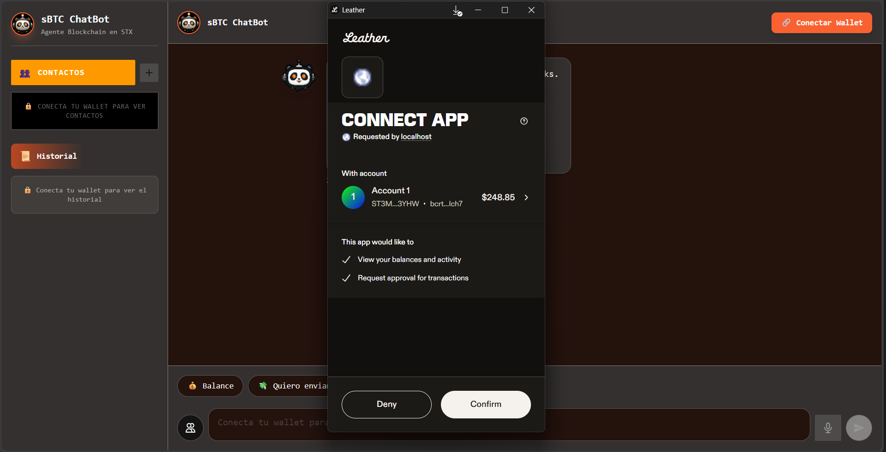
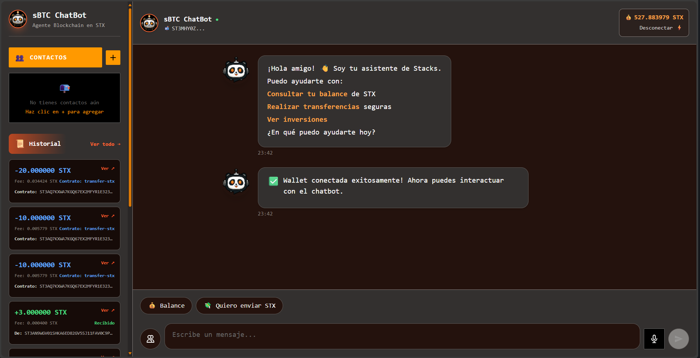
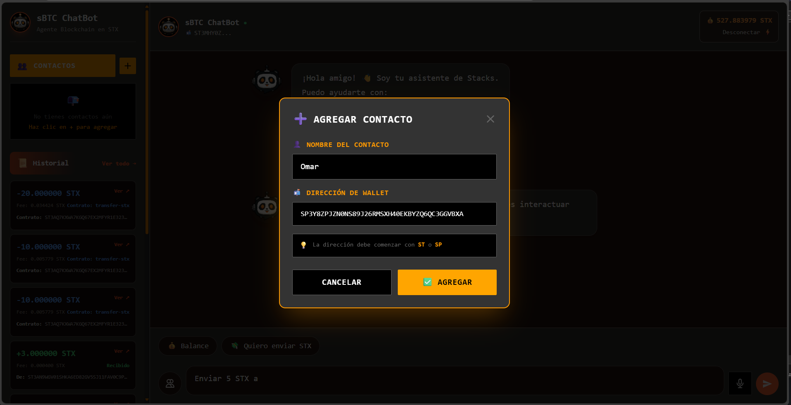
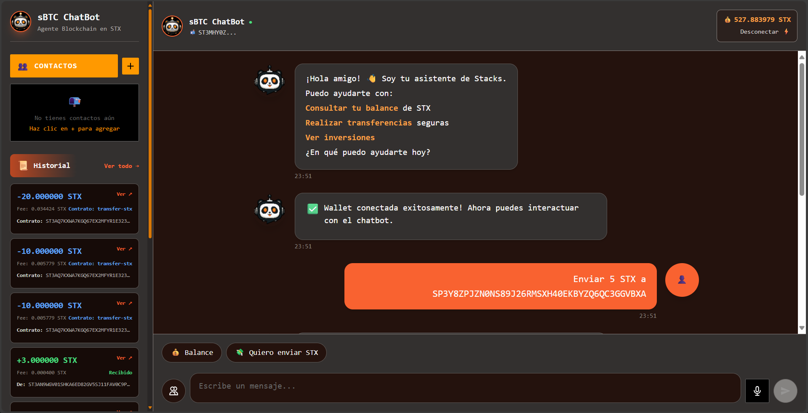
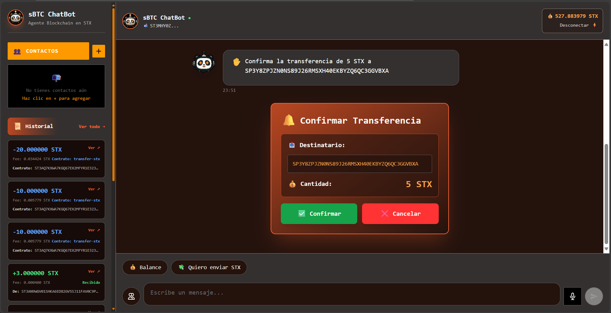
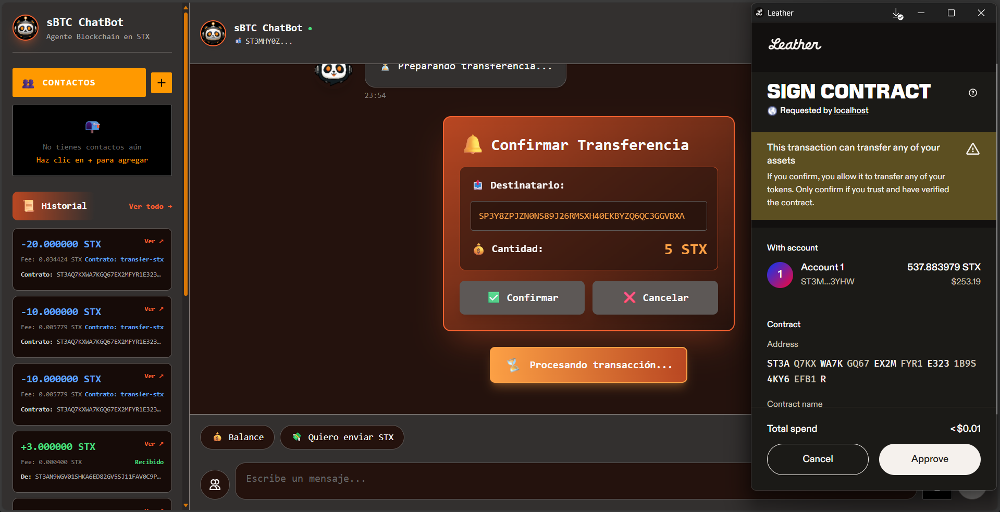

# 🚀 Clarity ChatBot - Interacción Inteligente con Blockchain Stacks

<div align="center">


[](https://opensource.org/licenses/MIT)
[](https://www.python.org/)
[](https://reactjs.org/)


</div>

---

## 🎯 **¿Qué es Clarity ChatBot?**

**Clarity ChatBot** es una aplicación revolucionaria que democratiza la interacción con contratos inteligentes en la blockchain de Stacks. Utilizando inteligencia artificial avanzada, permite a usuarios interactuar con contratos Clarity usando lenguaje natural, eliminando la barrera técnica de la programación blockchain.

### 🌟 **Características Principales**

- 🤖 **IA Conversacional**: Chat inteligente con contratos Clarity usando lenguaje natural
- 💸 **Transferencias Seguras**: Envío de STX con confirmación en múltiples pasos
- 🔍 **Consultas en Tiempo Real**: Balances, historial y estado de contratos
- 🔐 **Seguridad Blockchain**: Integración nativa con wallets de Stacks
- 📱 **Interfaz Responsiva**: Experiencia perfecta en móvil y desktop
- ⚡ **Procesamiento Instantáneo**: Respuestas en tiempo real con IA

---

## 🏗️ **Arquitectura del Sistema**

```
┌─────────────────┐    ┌─────────────────┐    ┌─────────────────┐
│   Frontend      │    │     Backend      │    │   Blockchain    │
│   React +       │◄──►│   Flask +        │◄──►│   Stacks         │
│   Tailwind      │    │   DeepSeek AI    │    │   Testnet        │
│                 │    │                  │    │                 │
│ • Chat UI       │    │ • API REST       │    │ • Contratos      │
│ • Wallet Connect│    │ • IA Processing  │    │ • STX Transfers  │
│ • Responsive    │    │ • Transaction Prep│    │ • Balance Query  │
└─────────────────┘    └─────────────────┘    └─────────────────┘
```

### 🛠️ **Tecnologías Utilizadas**

| Componente | Tecnología | Versión | Propósito |
|------------|------------|---------|-----------|
| **Frontend** | React | 19.1.1 | Interfaz de usuario moderna |
| **Build Tool** | Vite | 7.1.12 | Desarrollo rápido y optimizado |
| **Styling** | Tailwind CSS | 3.4.1 | Diseño responsivo y elegante |
| **Backend** | Flask | 3.0.0 | API REST ligera y eficiente |
| **IA** | DeepSeek | API | Procesamiento de lenguaje natural |
| **Blockchain** | Stacks | Testnet | Contratos inteligentes Clarity |
| **Wallets** | Hiro/Xverse | SDK | Conexión segura con wallets |

---

## 🎨 **Diseño y UX**

### 🎨 **Paleta de Colores Personalizada**

Nuestro diseño utiliza una paleta de colores cuidadosamente seleccionada para una experiencia visual óptima:

| Color | Hex | Uso |
|-------|-----|-----|
| **Licorice** | `#24120d` | Fondos oscuros profundos |
| **Jet** | `#33302f` | Elementos secundarios |
| **Giants Orange** | `#f96230` | Acentos principales |
| **Sandy Brown** | `#fca045` | Destacados y negritas |
| **Rust** | `#b94722` | Estados hover |
| **Seasalt** | `#fafafa` | Textos claros |

### 📱 **Interfaz Responsiva**

- **Móvil (< 640px)**: Optimizado para pantallas táctiles
- **Tablet (640-1024px)**: Layout adaptativo
- **Desktop (> 1024px)**: Experiencia completa

### 💬 **Sistema de Mensajes Enriquecido**

Los mensajes del chatbot incluyen formato especial:
- ✅ **Transacciones**: Banner verde + botón explorer
- 💰 **Balances**: Negritas en montos importantes
- 🔗 **Enlaces**: Botones clicables automáticos
- 📋 **Listas**: Emojis organizados visualmente

---

## 🚀 **Cómo Funciona**

### 📸 **Flujo de Uso - Paso a Paso**

#### 1️⃣ **Landing Page - Bienvenida**
<div align="center">

<p><i>Página de inicio con información del proyecto</i></p>
</div>

#### 2️⃣ **Conectar Wallet**
<div align="center">

<p><i>Selecciona tu wallet de Stacks (Hiro o Xverse)</i></p>
</div>

#### 3️⃣ **Wallet Conectada**
<div align="center">

<p><i>Wallet conectada exitosamente y lista para usar</i></p>
</div>

#### 4️⃣ **Agregar Contacto**
<div align="center">

<p><i>Guarda direcciones de tus contactos frecuentes</i></p>
</div>

#### 5️⃣ **Enviar STX**
<div align="center">

<p><i>Solicita transferencia usando lenguaje natural</i></p>
</div>

#### 6️⃣ **Confirmar Envío**
<div align="center">

<p><i>Revisa los detalles de la transacción</i></p>
</div>

#### 7️⃣ **Aprobar en Wallet**
<div align="center">

<p><i>Autoriza la transacción en tu wallet</i></p>
</div>

#### 8️⃣ **Transacción Finalizada**
<div align="center">

<p><i>Confirmación exitosa con enlace al explorador</i></p>
</div>

---

### 🔄 **Flujo Técnico**

### 1️⃣ **Conexión con Wallet**
```javascript
// Usuario conecta su wallet de Stacks
connectWallet() → Seleccionar Hiro/Xverse → Autorizar
```

### 2️⃣ **Chat Inteligente**
```javascript
// Usuario escribe en lenguaje natural
"Envía 50 STX a mi amigo"

// IA DeepSeek procesa y entiende
{
  "action": "transfer",
  "amount": 50,
  "message": "Transferir 50 STX"
}
```

### 3️⃣ **Ejecución Segura**
```javascript
// Backend prepara transacción
prepareTransfer() → Contract call → Wallet confirmation
```

### 4️⃣ **Confirmación Visual**
```javascript
// Usuario ve resultado formateado
✅ Transacción completada
📋 ID: abc123...
🔗 Ver en Explorer
```

---

## 📊 **Casos de Uso**

### 💰 **Gestión de Finanzas Personales**
- Consultar balance de STX en tiempo real
- Transferir tokens de forma segura
- Historial de transacciones completo

### 🤝 **Interacciones Sociales**
- Enviar STX a amigos y familiares
- Compartir direcciones de wallet
- Confirmar transacciones con emojis

### 🔧 **Desarrollo Blockchain**
- Probar contratos Clarity rápidamente
- Interactuar con funciones del contrato
- Depurar transacciones en testnet

### 📈 **Educación Blockchain**
- Aprender sobre Stacks de forma intuitiva
- Experimentar con transacciones reales
- Entender conceptos blockchain

---

## 🔧 **Instalación y Configuración**

### 📦 **Requisitos Previos**

- **Node.js** 16+ (para frontend)
- **Python** 3.8+ (para backend)
- **Wallet de Stacks** (Hiro, Xverse, Leather)
- **Cuenta DeepSeek** (para API de IA)

### 🚀 **Inicio Rápido**

#### Backend (API)
```bash
# Clonar y configurar
git clone https://github.com/JHAMILCALI/clarity-backend.git
cd clarity-backend

# Instalar dependencias
pip install -r requirements.txt

# Configurar variables
cp .env.example .env
# Editar .env con tu DEEPSEEK_API_KEY

# Ejecutar
python app.py
```

#### Frontend (ChatBot)
```bash
# Clonar y configurar
git clone https://github.com/JHAMILCALI/clarity-chatbot.git
cd clarity-chatbot

# Instalar dependencias
npm install

# Ejecutar
npm run dev
```

### 🌐 **URLs de Desarrollo**
- **Frontend**: http://localhost:5173
- **Backend**: http://localhost:5000
- **API Producción**: https://clarity-backend-duun.onrender.com

---

## 🎯 **Problema que Resuelve**

### ❌ **Problemas Tradicionales**
- **Barrera Técnica**: Programar contratos requiere conocimientos avanzados
- **Interfaz Compleja**: Herramientas blockchain son difíciles de usar
- **Curva de Aprendizaje**: Nuevos usuarios se sienten abrumados
- **Seguridad**: Riesgos en transacciones manuales

### ✅ **Nuestra Solución**
- **Lenguaje Natural**: "Envía 50 STX a Juan" en lugar de código complejo
- **Interfaz Intuitiva**: Chat conversacional familiar
- **Confirmaciones Visuales**: Cada paso es claro y seguro
- **IA Avanzada**: DeepSeek entiende contexto y intención

---

## 📈 **Impacto y Beneficios**

### 👥 **Para Usuarios Finales**
- **Accesibilidad**: Cualquiera puede usar blockchain sin conocimientos técnicos
- **Seguridad**: Confirmaciones múltiples previenen errores
- **Educación**: Aprenden blockchain de forma natural
- **Eficiencia**: Operaciones complejas en segundos

### 🏢 **Para Empresas**
- **Adopción**: Facilita la migración a blockchain
- **Productividad**: Desarrolladores enfocados en lógica de negocio
- **Experiencia**: UX excepcional aumenta engagement
- **Escalabilidad**: Arquitectura preparada para crecimiento

### 🌐 **Para el Ecosistema Stacks**
- **Adopción**: Más usuarios en la red Stacks
- **Utilización**: Mayor uso de contratos Clarity
- **Innovación**: Nuevos casos de uso descubiertos
- **Comunidad**: Crecimiento del ecosistema

---

## 🔮 **Roadmap Futuro**

### 🚀 **Próximas Características**
- [ ] **Contratos Multiples**: Soporte para múltiples contratos simultáneamente
- [ ] **NFT Integration**: Gestión de tokens no fungibles
- [ ] **DeFi Features**: Interacción con protocolos DeFi
- [ ] **Multi-idioma**: Soporte para español, inglés, portugués
- [ ] **Voice Commands**: Control por voz para accesibilidad

### 📊 **Métricas de Éxito**
- [ ] **Usuarios Activos**: 1000+ usuarios mensuales
- [ ] **Transacciones**: 10000+ transacciones procesadas
- [ ] **Satisfacción**: 95%+ rating de usuarios
- [ ] **Uptime**: 99.9% disponibilidad del servicio

---

## 🤝 **Contribuir**

¡Las contribuciones son bienvenidas! Este proyecto es open source y creemos en la colaboración comunitaria.

### 📝 **Cómo Contribuir**

1. **Fork** el proyecto
2. **Crea** una rama para tu feature (`git checkout -b feature/AmazingFeature`)
3. **Commit** tus cambios (`git commit -m 'Add some AmazingFeature'`)
4. **Push** a la rama (`git push origin feature/AmazingFeature`)
5. **Abre** un Pull Request

### 🐛 **Reportar Issues**

- Usa el template de issue para bugs
- Incluye pasos para reproducir
- Agrega screenshots si es relevante
- Etiqueta apropiadamente

### 💡 **Ideas de Contribución**

- **UI/UX**: Mejoras en la interfaz
- **IA**: Optimización de prompts de DeepSeek
- **Backend**: Nuevos endpoints de API
- **Blockchain**: Integración con nuevos contratos
- **Documentación**: Traducciones y guías

---

## 📄 **Documentación**

### 📚 **Guías Disponibles**

- [**README Backend**](https://github.com/JHAMILCALI/clarity-backend/blob/main/README.md) - API completa y configuración
- [**README Frontend**](https://github.com/JHAMILCALI/clarity-chatbot/blob/main/README.md) - Interfaz y componentes
- [**Guía de Integración**](https://github.com/JHAMILCALI/clarity-backend/blob/main/INTEGRATION_GUIDE.md) - Conectar frontend/backend
- [**Formato de Mensajes**](https://github.com/JHAMILCALI/clarity-chatbot/blob/main/MESSAGE_FORMAT_GUIDE.md) - Sistema de mensajes enriquecidos
- [**Testing**](https://github.com/JHAMILCALI/clarity-chatbot/blob/main/TESTING_FORMAT.md) - Guía de pruebas

### 🎯 **Ejemplos de Uso**

```javascript
// Consultar balance
"¿Cuánto STX tengo?"

// Transferir tokens
"Envía 25 STX a ST1PQHQKV0RJXZFY1DGX8MNSNYVE3VGZJSRTPGZGM"

// Leer contrato
"¿Cuál es el valor del contador?"
```

---

## 👥 **Equipo**

### 👨‍💻 **Desarrollador Principal**
**JHAMILCALI** - *Full Stack Blockchain Developer*

- 💼 **Rol**: Arquitecto de soluciones, desarrollador full-stack
- 🎯 **Experiencia**: React, Python, Blockchain, IA
- 🌟 **Visión**: Democratizar el acceso a blockchain
- 📧 **Contacto**: [GitHub](https://github.com/JHAMILCALI)

### 🤖 **Tecnologías Especializadas**
- **Frontend**: React 19, Tailwind CSS, Vite
- **Backend**: Flask, REST APIs, Python
- **Blockchain**: Stacks, Clarity, Smart Contracts
- **IA**: DeepSeek API, NLP, Chatbots
- **DevOps**: Render, GitHub Actions, CI/CD

---

## 📊 **Estadísticas del Proyecto**

<div align="center">


</div>

### 📈 **Métricas Técnicas**
- **Lenguajes**: JavaScript (60%), Python (35%), Clarity (5%)
- **Arquitectura**: Microservicios (Frontend + Backend)
- **Base de Datos**: Blockchain (Stacks Testnet)
- **API Endpoints**: 6 endpoints REST
- **Componentes React**: 15+ componentes reutilizables

---

## 🎉 **¡Únete a la Revolución Blockchain!**

Clarity ChatBot representa el futuro de las interfaces blockchain: **intuitivas, seguras y accesibles para todos**.

### 🚀 **¿Listo para Empezar?**

1. ⭐ **Da una estrella** al proyecto
2. 🍴 **Fork** y contribuye
3. 💬 **Únete** a la discusión
4. 🌟 **Comparte** con la comunidad

---

## 📞 **Soporte y Comunidad**

- 🐛 **Issues**: [GitHub Issues](https://github.com/JHAMILCALI/clarity-chatbot/issues)
- 💬 **Discussions**: [GitHub Discussions](https://github.com/JHAMILCALI/clarity-chatbot/discussions)
- 📧 **Email**: Para consultas directas
- 🌐 **Web**: [Sitio web del proyecto](https://clarity-chatbot.vercel.app)

### 📱 **Redes Sociales**

- 🐦 **Twitter**: [@ClarityChatBot](https://twitter.com/ClarityChatBot)
- 💼 **LinkedIn**: [JHAMILCALI](https://linkedin.com/in/jhamilcali)
- 📺 **YouTube**: [Tutoriales](https://youtube.com/@ClarityChatBot)

---

## 📜 **Licencia**

Este proyecto está bajo la **Licencia MIT**. Consulta el archivo `LICENSE` para más detalles.

```
MIT License - Copyright (c) 2025 JHAMILCALI

Se concede permiso para usar, copiar, modificar y distribuir
este software con las condiciones especificadas en la licencia.
```

---

<div align="center">

## 🎊 **¡Gracias por tu Interés!**

**Clarity ChatBot** - Donde la blockchain se encuentra con la conversación natural 🤖💬

---

**Hecho con ❤️ por [JHAMILCALI](https://github.com/JHAMILCALI)**

⭐ **Si te gusta el proyecto, ¡dale una estrella!** ⭐

</div></content>
<parameter name="filePath">c:\Users\OMAR\Documents\OMAR\HACKATHON\HACKATHON - STACK sBTC\Project\.github\profile\README.md